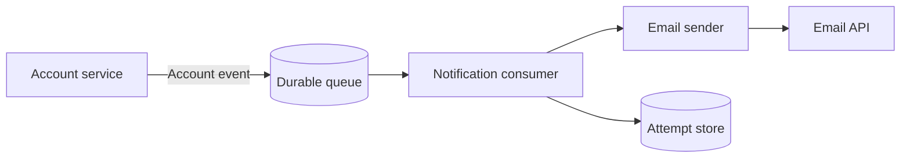

# Notification service — software architecture

## Overview

The service delivers email notifications for account events. It consumes messages from the application queue; it does not decide who should receive a message or block account requests on email delivery.

## Requirement

### Functional

- FR1: Consume and validate account events with an ID, type, recipient, and timestamp.
- FR2: Deduplicate deliveries, send email, and record each attempt and its outcome.
- FR3: Retry transient provider failures and report permanent rejections.

### Non-Functional

- NFR1: Queue redelivery must not send the same event twice; retain a durable event ID for deduplication.
- NFR2: Provider credentials must stay outside event payloads and the account service.
- NFR3: A burst of events must not delay account requests; alert when the queue grows.

## Design

### Components and Responsibilities

- The account service publishes events and knows only the event contract.
- The durable queue isolates delivery from account requests and retries transient failures.
- The consumer validates and deduplicates events; the sender formats and submits mail to the provider.
- The attempt store records event IDs, delivery outcomes, and retry attempts.

### Data and Control Flow

An account event enters the queue. The consumer validates it and checks the attempt store for its ID before the sender calls the provider. The consumer records the result; a transient failure is retried, while a permanent rejection is reported. Sending synchronously would avoid the queue but could delay account requests whenever the provider is slow.

### Interfaces and Contracts

`AccountEvent` contains `id`, `type`, `recipient`, and `timestamp`. `handle(event)` consumes the event, `send(message)` calls the provider, and `record(attempt)` persists its result. The event ID is the deduplication key; provider credentials never enter the payload.

## Implementation

### Consumer and storage

The notification service owns its consumer and attempt store; the account service imports only the event contract. Persist the deduplication key with the delivery outcome so queue redelivery is safe. Integration tests simulate duplicate events and provider timeouts.

### Delivery operations

Keep provider credentials in the notification service. Alert on a growing queue and repeated provider failures; disable sending and drain pending work if credentials are compromised. Load tests cover bursts without slowing the account service.

## References

- EX-34 — example notification requirement.
