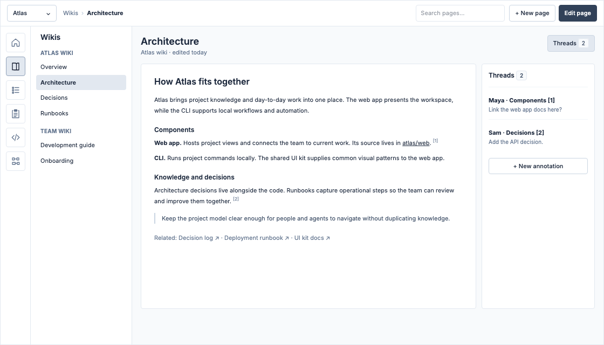
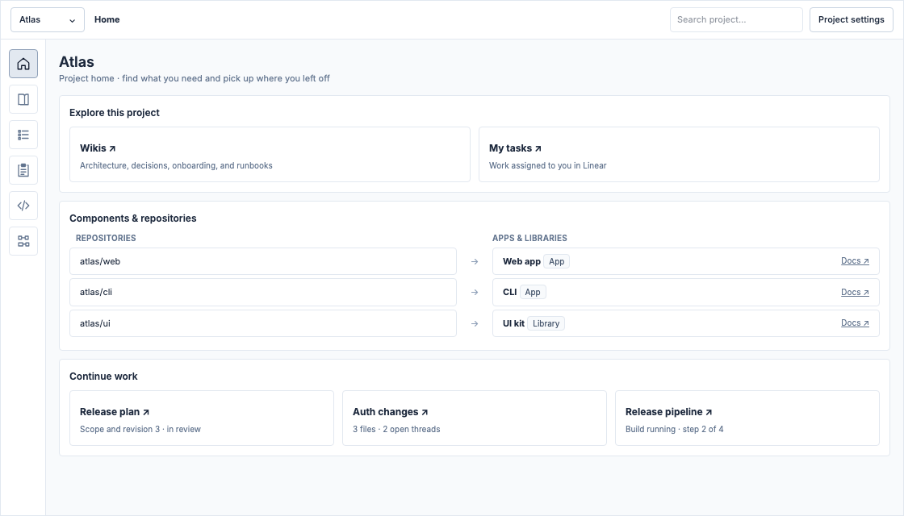
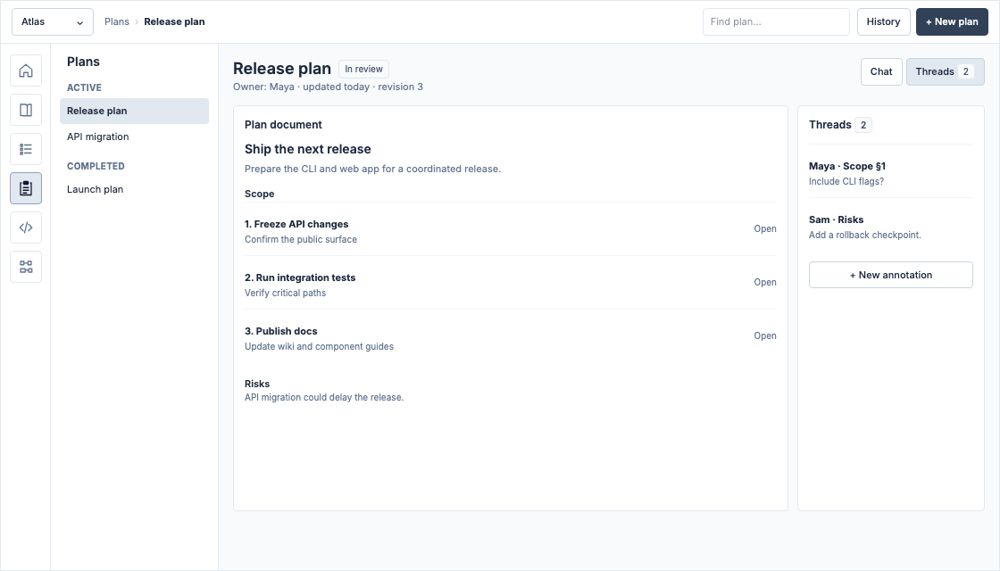
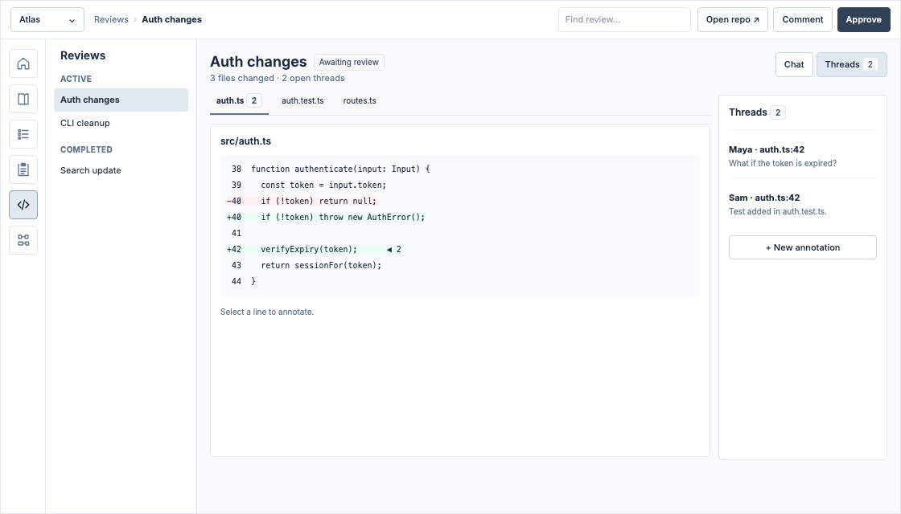
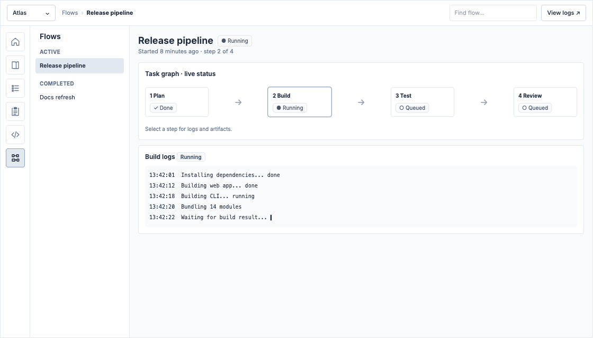
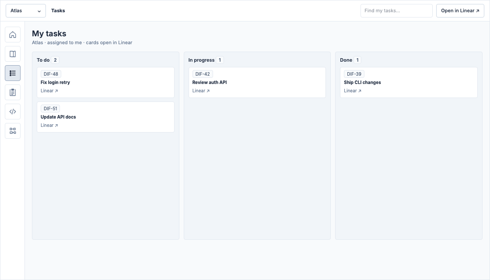

# Core concepts

- Status: draft
- Owner: [person or team]
- Date: [YYYY-MM-DD last updated]
- Related ADRs: [links, if any]

## Summary

Difflab supports agent-friendly human-first SWE. Everything must allow leveraging agents, without sacrificing UX, comprehensibility, editability or document/code native workflows.

## Problem and Evidence

There's a wide variety of processes and knowledge work essential to software development. Most platforms address this in a piecemeal fashion:

- Issue trackers are only concerned with issues
- VCS is only concerned with git repos
- Wikis are only concerned with documentation

Over time, platforms try to absorb each others functionalities, but the taxonomy or existing product can stand in the way. For instance, GitLab issues are incredibly clunky as are GitHub wikis. Linear is incorporating code review, but its limited, and the wiki story is weak and cos exist on ephemeral projects which are primarily for task management.

In the long term, Difflab needs to do all the above, but in the short term, establishing the right conceptual foundation/taxonomy is vital. It's possible this demands mulitple product surfaces which integrate with each other, but even this doesn't sidestep the taxonomy issue.

## Users and Use Cases

- Engineers
  - Manage work while communicating progress to stakeholders
  - Orchestrate agents
  - See project status over time and project completion dates
  - Maintain knowledge-bases for effective collaboration
- Product/Designers
  - Communicate product specifications and PRDs
  - Track defects, experiments, etc.
  - Plan and track product release

## Goals

- Enable a unified workspace that brings together issue management, knowledge management and eventually code management
- Enable agentic workflows and autonomous loops, with high observability
- Incorporate product management or integrate with complimentary surfaces which do
- Offer agent orchestration or integration with BYO agent capacities

## Non-Goals

- Infrastructure, gitops
- Experimentation support

## Proposed Experience

### Taxonomy

- **Organization** - An auth and ownership boundaries for literal organizations
- **Team** - Team assignments within an org, folks who need to be aware of each others work
- **Project** - A conceptual boundary comprising one or more applications and/or libraries that come together into a single product experience, whether as a standalone application or a service based product consumed by other teams. Also the core grouping unit in Difflab that connects all the entities below this point. Can be owned by
- **Repository** - A code repository which may consist of one or more app, libs, docs and/or wikis. Most things in difflab are git/vcs backed. Code lives in repos, but so do docs, wikis and potentially even tasks.
- **App** - A web or desktop app, even a CLI
- **Library**
- **Wiki** - A project/team scoped knowledge-base, an encyclopedia of standard practices, processes, etc.
- **Doc** - App/Lib scoped docs, which can be partitioned for private/public audiences
- **Design** - A project-scoped prototype or design note with linked visual assets
- **Deliverable** - A unit of project management which groups issues, and will appear on gantt charts for estimation and burndowns
- **Initiative** - Groups deliverables across one or more projects and teams, may nest other initiatives. Can belong to a team or org.
- **Task** - A single work item with statuses, which will appear in kanban boards. May have sub-tasks, which will never appear in

### Online & Offline

Difflab users can use `difflab` as a standalone local-first vcs-backed tool with a sqlite db that gets checked in, or eventually sign into their difflab account and manage non-code/doc data with Difflab as a service.

When operating offline, a local db stores concepts like projects etc. alongside a workspace in the user's home directory, which can be synced to git. Users will be able to create projects with the CLI, MCP or desktop app. When working with repos or docs, the connection to projects will be manifest via a `premise.yaml` file. The only difference in the online experience will be that this local git backed repository will be replaced by a remote database and difflab-managed repository to better handled concurrent multi-user/agent workloads.

### Knowledge management

In-repo docs and wikis will be supported for knowledge-base management. This experience is intended to be powered by the peer `diffwiki` and `diffbook` apps. `diffwiki` in particular will provide ways to maintain evolving agent-update-able knowledge-bases. Going beyond this however, `difflab` will enforce project and app/lib level ontologies. I.e. if a `Servive` means something specific in a codebase, those restrictions must be followed, etc. Module contracts must be observed and not broken without discussion. And so on. This capability is yet to be designed.

### Planning, Review & workflows

Difflab will offer iterative planning capabilities with a desktop app which will support annotation and revisions for plans. Maintaining histroy of these revisions, will also allow continue improvement of the planning process and learning of user/org preferences. This annotation workfflow will be extended to support local-only and remote-force synced reviews as well. Finally, org/team/project scoped workflows will allow full loops/graphs of pre-approved workflows tied into project-defined standards.

The long-term goals is high level IDE integrations that can make this process more seamlessly integrated with code-editing directly to maximize the power at the users fingertips.

### Project Management Needs To Work Without Native-Difflab Capabilities local-first

Project management can be highly entrenched into an organization, and is complex to build from scratch. Consequently, it's necessary to be able to tie into existing project management systems like Linear and Jira. To begin with, Difflab will track relationships between projects and one or more external Linear Projects, Jira EPICs, etc. Eventually this will be supplemented with difflab native project management.

## Requirements

## layout

These low-fidelity screens show the proposed layout, not final visual design.

- A top toolbar holds the project selector, breadcrumbs, search, and contextual actions.
- An icon-only app bar on the far left switches between Home, Wikis, Tasks, Plans, Reviews, and Flows.
- App status appears beside the page title, below the toolbar.
- Apps with nested navigation have a contextual sidebar; Home and Tasks use that space for content instead.

### Wikis

The Wikis app has its own sidebar for navigating project and team wiki pages; search lives in the top toolbar. Selecting a page opens a readable document without losing the app bar or page tree. The page header can open a right sidebar for annotation threads.

### Project home

Every project has a full-width landing page, without a contextual sidebar. It links to wikis, tasks, active plans, reviews, and flows. A small graph maps repositories to the project's apps and libraries, with links to their docs. A project can have several components and repositories; the home page is not a second place to edit them.

### Plans

Within a project, the Plans app's contextual sidebar lists active plans first and completed plans below. Selecting a plan opens its content and revision context. The page header has Chat and Threads buttons that open a right sidebar for an agent conversation or anchored annotations. Users can annotate the plan without editing its source text just to leave feedback.

### Reviews

Reviews use the same active-then-completed contextual sidebar pattern as Plans. A selected review shows code files in tabs and a diff for the selected file. Chat and Threads buttons in the page header open the agent conversation or code-line annotations in a right sidebar. Users can switch files without leaving the review.

### Flows

Flows also separate active and completed runs in their contextual sidebar. The selected run's status appears beside its name in the page header. A flow shows a directed acyclic graph of tasks with live status per step and a log for the selected step. The diagram updates as work progresses; the log remains readable after completion.

### Tasks

Tasks show the current user's work for the selected project in a full-width Kanban board without a contextual sidebar. For now, each card links to its record in an external tracker such as Linear or Jira; the board does not claim to replace that tracker.

### CLI

All functionality shown above should be accessible via CLI and MCP. A user working in Claude/Codex/Cursor/Pi should be able to have their agents understand the Difflab project's context, presently relevant plans/reviews/flows. Some functionality like review would be impractical via CLI alone, and may require tui support in addition to the desktop app.

### AG UI / Chat (Reach)

Ideally the inverse relationship can be powered through AG UI.

### Agent Skills

Agent skills will be needed to enable working with Difflab MCP from various harnesses.

### Opt-Out Capable Product Metrics

This would allow knowing adoption, bugs, etc.

## Success Measures

### [User outcome or signal]

- Users can use all the flows above without issue
- Users can run multiple flows concurrently

### Metrics

- GitHub stars
- Github bugs/issues
- Product analytics

## Risks and Dependencies

- WIP

## Open Questions

- WIP

## Rollout

NA
